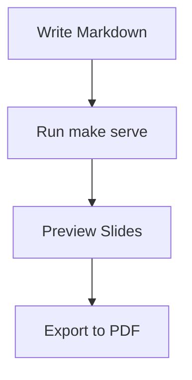

# Presentations Repository
## Markdown to Slides Made Simple

Create professional presentations with just markdown

---

## What This Repository Does

**Transform markdown into beautiful presentations**

- Write in familiar markdown syntax
- Preview live with hot reload
- Export to PDF or HTML
- Use professional themes
- Share anywhere

Note:
This presentation demonstrates the presentations repository - a simple system for creating slides from markdown files.

---

## Quick Start

```bash
# Create new presentation
make new NAME=my-talk

# Start development server
make serve

# Preview your presentation
make preview NAME=my-talk

# Export to PDF
make export NAME=my-talk
```

**That's it!** Your presentation is ready.

---

## Slide Syntax

---

### Basic Slide Structure

```markdown
# Main Topic 1

Content for the first slide

---

# Main Topic 2

Content for the second slide

---

## Main Topic 3

Content for the third slide
```

**Key:** Use `---` to separate slides

---

### Text Formatting

```markdown
**Bold text** for emphasis
*Italic text* for subtle points
`Code snippets` for technical terms

> Important quotes or statements

- Bullet points
- Organize information
- Keep it simple
```

**Result:**
**Bold text** for emphasis
*Italic text* for subtle points
`Code snippets` for technical terms

> Important quotes or statements

---

### Code Examples

```markdown
```javascript
function greetPresentation() {
    return "Hello, Slides!";
}
```
```

**Renders as:**

```javascript
function greetPresentation() {
    return "Hello, Slides!";
}
```

Syntax highlighting works for 100+ languages!

---

### Lists

```markdown
### Key Features
- Easy to write
- Version controlled
- Professional output
- Fast iterations
```

**Result:**
- Easy to write
- Version controlled
- Professional output
- Fast iterations

---

### Tables

```markdown
| Feature       | Markdown | PowerPoint  |
| ------------- | -------- | ----------- |
| Speed         | ✅ Fast   | ❌ Slow      |
| Collaboration | ✅ Easy   | ❌ Difficult |
```

**Result:**

| Feature       | Markdown | PowerPoint  |
| ------------- | -------- | ----------- |
| Speed         | ✅ Fast   | ❌ Slow      |
| Collaboration | ✅ Easy   | ❌ Difficult |

---

## Animations

---

### Fragment Animations

**Progressive content reveal:**

- First point appears immediately
- Second point appears on click <!-- .element: class="fragment" -->
- Third point fades up <!-- .element: class="fragment fade-up" -->
- Fourth point zooms in <!-- .element: class="fragment zoom-in" -->
- Final point highlighted <!-- .element: class="fragment highlight-red" -->

**Usage:** Add `<!-- .element: class="fragment" -->` after content

---

### Code Reveals

```javascript
// Base function appears first
function processData(input) {
```
<!-- .element: class="fragment" -->

```javascript
    // Validation appears second
    if (!input) return null;
```
<!-- .element: class="fragment" -->

```javascript
    // Processing appears last
    return input.toUpperCase();
}
```
<!-- .element: class="fragment" -->

Perfect for step-by-step code explanations!

---

### Available Fragment Types

```markdown
<!-- Basic animations -->
<!-- .element: class="fragment" -->
<!-- .element: class="fragment fade-up" -->
<!-- .element: class="fragment zoom-in" -->

<!--- Highlights --->
<!-- .element: class="fragment highlight-red" -->
<!--- .element: class="fragment highlight-blue" --->
<!--- .element: class="fragment highlight-green" --->
```

Use arrow keys or space to trigger animations during presentation.

---

## Visual Elements

---

### Mathematical Expressions

```markdown
Inline math: $E = mc^2$

Block equations:
$$\sum_{i=1}^{n} x_i = \frac{n(n+1)}{2}$$
```

**Result:**

Inline math: $E = mc^2$

Block equations:
$$\sum_{i=1}^{n} x_i = \frac{n(n+1)}{2}$$

---

### Diagrams with Mermaid

```markdown

```

**Result:**


---

### Images and Media

```markdown


<!-- With size control -->


<!-- GIF animations -->

```

**Best practices:**
- Use descriptive alt text
- Optimize image sizes (< 1MB recommended)
- GIFs work great for demos
- Support responsive layouts

---

### Background Images

**Full slide backgrounds:**

```markdown
<!-- .slide: data-background="image.jpg" -->
# Slide with Background Image

Content appears over the background

<!-- .slide: data-background="gradient.jpg" data-background-size="cover" -->
# Covered Background

Background scales to cover entire slide
```

**Background options:**
- `data-background-size="cover"` - Scale to cover slide
- `data-background-position="center"` - Position background
- `data-background-opacity="0.5"` - Transparency control

---

### Grid Layouts

**Two-column layout:**

<div style="display: grid; grid-template-columns: 1fr 1fr; gap: 20px;">

<div>

**Left Column**
- First point
- Second point
- Third point

</div>

<div>

**Right Column**
- Code examples
- Images
- Diagrams

</div>

</div>

---

### Grid Examples

**Three-column grid:**

<div style="display: grid; grid-template-columns: 1fr 1fr 1fr; gap: 15px;">

<div>

### Column 1
- Feature A
- Feature B

</div>

<div>

### Column 2
- Feature C
- Feature D

</div>

<div>

### Column 3
- Feature E
- Feature F

</div>

</div>

**Perfect for:** Feature comparisons, stats, team member cards

---

### Advanced Layouts

**Image + text grid:**

<div style="display: grid; grid-template-columns: 300px 1fr; gap: 30px; align-items: center;">

<div>

<!-- Placeholder for image -->
<div style="width: 280px; height: 200px; background: #f0f0f0; border: 2px dashed #ccc; display: flex; align-items: center; justify-content: center; color: #666;">
Your Image Here<br/>
(280x200px)
</div>

</div>

<div>

### Product Feature

**Key benefits:**
- Easy to implement
- Responsive design
- Professional appearance
- Customizable layouts

**Use cases:** Product showcases, team introductions, before/after comparisons

</div>

</div>

---

## Themes

---

### Built-in Themes

Test different looks instantly:

```bash
# Professional white theme (default)
make test-theme NAME=demo THEME=white

# Dark theme for technical content
make test-theme NAME=demo THEME=black

# Developer-friendly colors
make test-theme NAME=demo THEME=solarized

# Modern presentation style
make test-theme NAME=demo THEME=league
```

---

### Popular Themes

**Professional themes:**
- `white` - Clean, business presentations
- `black` - Dark background for technical talks
- `solarized` - Developer-friendly colors

**Creative themes:**
- `league` - Modern gray with yellow accents
- `night` - Dark blue with orange highlights
- `beige` - Warm, academic style

**No custom CSS needed** - just pick a theme!

---

## Speaker Features

---

### Speaker Notes

This content is visible to your audience.

Animations and reveals work as expected. <!-- .element: class="fragment" -->

Note:
These are speaker notes - only you can see them!

- Press 'S' during presentation to open speaker view
- Include timing reminders
- Add talking points
- Note key explanations
- Reference backup information

Perfect for managing your presentation flow.

---

### Navigation Controls

**During presentation:**

| Key             | Action                  |
| --------------- | ----------------------- |
| **Space/Arrow** | Next slide/fragment     |
| **Shift+Space** | Previous slide/fragment |
| **S**           | Speaker notes view      |
| **F**           | Fullscreen mode         |
| **ESC**         | Overview mode           |
| **B**           | Blackout screen         |

**Mobile:** Swipe gestures work on touch devices

---

## Export Options

---

### Multiple Formats

**Web Presentation:**
```bash
make serve  # Development with hot reload
make build  # Static HTML for deployment
```

**PDF Export:**
```bash
make export NAME=my-presentation
# Creates build/my-presentation.pdf
```

**Sharing:**
- Email PDF attachments
- Host HTML files anywhere
- Share GitHub repository
- Embed in websites

---

### Deployment Examples

**GitHub Pages:**
- Push to repository
- Enable GitHub Pages
- Automatic deployment

**Static Hosting:**
- Netlify: Drag and drop build folder
- Vercel: Connect GitHub repository
- AWS S3: Upload static files

**Self-hosted:**
- Copy build files to web server
- Works with any HTTP server

---

## Development Workflow

---

### File Organization

```
presentations/
├── slides/
│   ├── demo.md              # This presentation
│   ├── project-update.md    # Team presentation
│   └── tech/
│       └── api-docs.md      # Technical documentation
├── build/                   # Generated files
└── examples/                # Reference materials
```

**Organize by:**
- Topic (`tech/`, `business/`)
- Date (`2024-q1/`, `2024-q2/`)
- Audience (`internal/`, `public/`)

---

### Best Practices

**Content:**
- One main idea per slide
- Use bullet points for lists
- Include speaker notes
- Test animations before presenting

**Technical:**
- Keep images under 1MB
- Use descriptive filenames
- Test on target devices
- Have PDF backup ready

---

### Common Workflow

1. **Plan** - Outline your presentation structure
2. **Create** - `make new NAME=my-topic`
3. **Write** - Edit `.md` file with content
4. **Preview** - `make preview NAME=my-topic`
5. **Iterate** - Refine content and animations
6. **Export** - `make export NAME=my-topic`
7. **Present** - Use speaker view (`S` key)

---

## Use Cases

---

### Technical Documentation

**Perfect for:**
- API documentation walkthroughs
- Code review presentations
- Architecture overviews
- Tutorial content

**Benefits:**
- Version controlled with your code
- Easy to update and maintain
- Syntax highlighting built-in
- Collaborative editing

---

### Team Presentations

**Great for:**
- Project status updates
- Sprint reviews
- Planning sessions
- Knowledge sharing

**Advantages:**
- Quick to create and update
- Consistent formatting
- Easy to share and reuse
- Professional appearance

---

### Educational Content

**Use for:**
- Course materials
- Workshop presentations
- Training sessions
- Conference talks

**Features:**
- Progressive content disclosure
- Interactive elements
- Mathematical expressions
- Multimedia support

---

## Getting Started

---

### Installation Check

```bash
# Verify you have Node.js installed
node --version

# Install dependencies
make setup

# Create your first presentation
make new NAME=getting-started

# Start developing
make serve
```

**Visit:** http://localhost:8000/getting-started.md

---

### Your First Slide

Edit `slides/getting-started.md`:

```markdown
# My First Presentation
## Learning Markdown Slides

Welcome to my presentation!

---

## Agenda

- Topic 1
- Topic 2
- Questions

---

## Topic 1

Content goes here...

Note:
Remember to add speaker notes!
```

Save and see changes instantly in your browser.

---

### Next Steps

**Try these features:**
1. Add fragment animations to your content
2. Include a code example with syntax highlighting
3. Create a simple table or list
4. Add speaker notes for your talking points
5. Test different themes
6. Export to PDF

**Time to first presentation:** Under 10 minutes!

---

## Tips and Tricks

---

### Content Tips

**Keep slides focused:**
- One main point per slide
- Break complex topics into multiple slides
- Break long content into multiple slides
- Include plenty of white space

**Make it visual:**
- Use bullet points instead of paragraphs
- Add diagrams for complex concepts
- Include relevant images
- Use consistent formatting

---

### Technical Tips

**Performance:**
- Optimize images before adding
- Test on slower devices
- Use built-in themes
- Avoid heavy animations

**Compatibility:**
- Test on different browsers
- Check mobile responsiveness
- Have offline backup
- Verify external links

---

### Presentation Tips

**Before presenting:**
- Practice with speaker notes view
- Test all animations and transitions
- Prepare for technical difficulties
- Have PDF backup ready

**During presentation:**
- Use speaker view (`S` key)
- Advance slides deliberately
- Engage with your audience
- Have water nearby!

---

## Summary

**This presentations repository provides:**

- ✅ **Simple markdown-to-slides conversion**
- ✅ **Professional themes out of the box**
- ✅ **Live development with hot reload**
- ✅ **Multiple export formats**
- ✅ **Version control friendly**
- ✅ **Zero configuration required**

**Perfect for developers, educators, and presenters who want to focus on content, not formatting.**

---

## Try It Now!

```bash
# Clone and start
git clone [repository-url]
cd presentations
make setup

# Create your presentation
make new NAME=my-awesome-talk
make preview NAME=my-awesome-talk

# Edit slides/my-awesome-talk.md
# Watch your presentation come to life!
```

**Remember:** Great presentations enhance your message - start with great content, let the tools handle the rest.

---

## Thank You!

**Questions?**

**Resources:**
- Repository documentation
- Example presentations in `examples/`
- Built-in help: `make help`

**Happy presenting!** 🎉

Note:
This concludes our demo of the presentations repository. The system is designed to be simple, powerful, and focused on helping you create great content without getting bogged down in technical details.

Key takeaway: Write markdown, get professional presentations. It's that simple!
