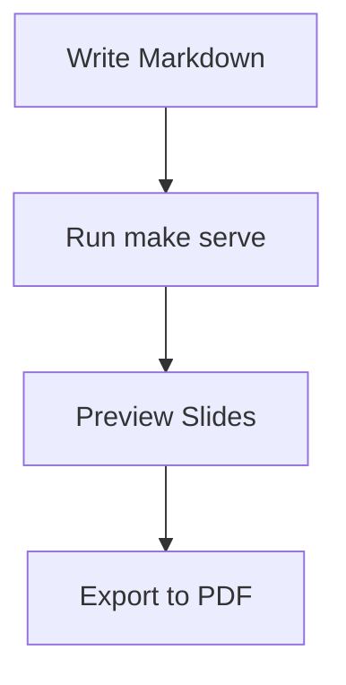

# Presentations Repository
## Markdown to Slides Made Simple

Transform markdown into beautiful presentations

---

## Quick Start

```bash
# Create new presentation
make new NAME=my-talk

# Start development server
make serve

# Export to PDF
make export NAME=my-talk
```

**That's it!** Your presentation is ready.

---

## Basic Syntax

### Slide Separators
```markdown
# Slide 1
Content here

---

# Slide 2
More content

--

## Sub-slide (vertical)
Access with Up/Down arrows
```

**Navigation:** Arrow keys or swipe gestures

--

### Vertical Navigation Demo

This is a **vertical slide** - you reached it by pressing **Down arrow**!

**Key features:**
- Main topics horizontal (`---`)
- Sub-topics vertical (`--`)
- Press **Up** to go back to main slide

--

### Step-by-Step Tutorial

**Perfect for tutorials:**
1. First explain the concept
2. Show the implementation
3. Demonstrate the result

**Tip:** Press **ESC** for slide overview to see the 2D structure

---

## Text & Code

### Formatting
**Bold**, *italic*, `code`, and lists:
- Easy to write
- Version controlled
- Professional output

### Code Blocks
```javascript
function greetPresentation() {
    return "Hello, Slides!";
}
```

Syntax highlighting for 100+ languages!

---

## Visual Elements

### Mermaid Diagrams


### Images & Media
```markdown


```

---

## Advanced Features

### Fragment Animations
- First point appears immediately
- Second point appears on click <!-- .element: class="fragment" -->
- Third point fades up <!-- .element: class="fragment fade-up" -->
- Final point highlighted <!-- .element: class="fragment highlight-red" -->

### Grid Layouts
<div style="display: grid; grid-template-columns: 1fr 1fr; gap: 20px;">

<div>

**Left Column**
- Feature A
- Feature B

</div>

<div>

**Right Column**
- Feature C
- Feature D

</div>

</div>

---

## Themes & Export

### Built-in Themes
```bash
# Test different themes instantly
make test-theme NAME=demo THEME=solarized
make test-theme NAME=demo THEME=night
make test-theme NAME=demo THEME=league
```

**Available:** white, black, solarized, league, night, beige, sky

### Export Options
```bash
make export NAME=demo    # PDF
make build              # Static HTML
```

**Share anywhere:** PDF, web hosting, GitHub Pages

---

## Speaker Features

### Navigation Controls

**Navigation table:**

| Key | Action |
| --------------- | ------------------- |
| **Space/Arrow** | Next slide/fragment |
| **Up/Down**     | Vertical navigation |
| **S**           | Speaker notes view  |
| **ESC**         | Overview mode       |

### Speaker Notes
This content is visible to your audience.

Note:
These are speaker notes - only you can see them!
- Press 'S' during presentation
- Include timing reminders
- Add talking points

---

## Summary

**This presentations repository provides:**

- ✅ **Simple markdown-to-slides conversion**
- ✅ **Professional themes out of the box**
- ✅ **2D navigation (horizontal + vertical)**
- ✅ **Multiple export formats**
- ✅ **Live development with hot reload**

**Perfect for developers, educators, and presenters.**

---

## Try It Now!

```bash
# Create your presentation
make new NAME=my-awesome-talk
make preview NAME=my-awesome-talk

# Edit slides/my-awesome-talk.md
# Watch your presentation come to life!
```

**Time to first presentation:** Under 5 minutes!

**Questions? Happy presenting!** 🎉

Note:
This concludes our streamlined demo. Key takeaway: Write markdown, get professional presentations with 2D navigation. It's that simple!
